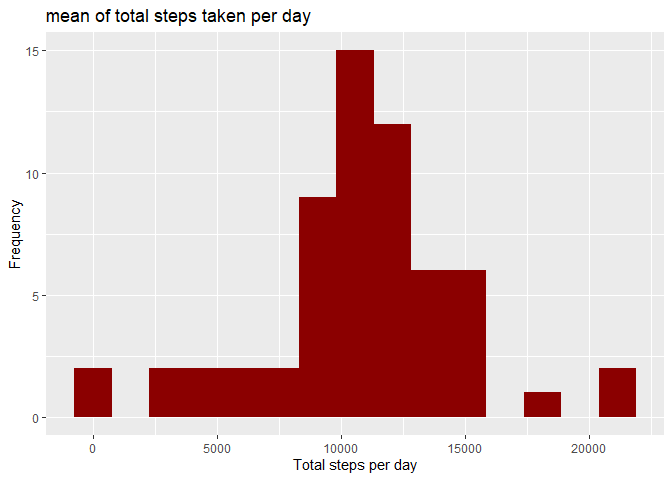

##Loading the required packages for the analysis

```r
library(ggplot2)
library(stringr)
library(lubridate)
```
## Loading and preprocessing the data
unzip the data and load the data 

```r
if(!file.exists('activity.csv')  ){
    unzip("activity.zip" ) 
}
activitiesdata <-read.csv("activity.csv")
```
## What is mean total number of steps taken per day?


```r
stepsperday <-aggregate(steps ~ date, data = activitiesdata, sum)
g <-ggplot(stepsperday, aes(x=steps))
(g + geom_histogram( fill = "red4",bins = 15) +
    labs(title = "mean of total steps taken per day")+
    labs(x = "Total steps per day", y = "Frequency"))
```

<!-- -->
    
Calculate the mean and median of the total number of steps taken per day

```r
paste("mean = ", round(mean(stepsperday$steps,na.rm = TRUE),4))
```

```
## [1] "mean =  10766.1887"
```

```r
paste("median = ",median(stepsperday$steps,na.rm = TRUE))
```

```
## [1] "median =  10765"
```

## What is the average daily activity pattern?
time series plot of the 5-minute interval average steps taken across all days

```r
library(stringr)
inervalstepsmean <-aggregate(steps ~ interval, data = activitiesdata, mean)
inervalstepsmean$daytime <- as.character(inervalstepsmean$interval)
for(i in 1:length(inervalstepsmean$daytime)) {
    variable <- inervalstepsmean$daytime[i]
    if (str_length(variable) < 4) {
        pading<-strrep(0,(4-str_length(variable)))
        variable <-paste(pading,variable,sep = "",collapse ="")
    }
    varhour  <-substr(variable,1, 2)
    varmints <-substr(variable,3, 4)
    variable <- paste(varhour,varmints,sep = "")
    inervalstepsmean$daytime[i]<-as.character(variable)
}
inervalstepsmean$daytime <-as.POSIXct(inervalstepsmean$daytime, format = "%H%M")
g <- ggplot(inervalstepsmean, aes(y=steps,x=daytime))
(g  + geom_line(col = "red4")
    + labs(y= "steps mean" ,x="day time")
    + labs(title="mean of total steps taken per day time",lwd= 3) 
    + scale_x_datetime(date_labels = "%H:%M",date_breaks = "3 hours")
    )
```

<!-- -->
    
interval of the day which has max mean of steps

```r
inervalstepsmean[which.max(inervalstepsmean$steps),1:2]
```

```
##     interval    steps
## 104      835 206.1698
```
## Imputing missing values
the total number of missing values in the dataset and the mean missing values in the dataset.

```r
NaIntervals <-is.na(activitiesdata$steps)
NaForDays <-tapply(NaIntervals, activitiesdata$date, FUN = sum )
sum(NaIntervals)
```

```
## [1] 2304
```

```r
mean(NaIntervals)
```

```
## [1] 0.1311475
```
    
days which has missing values for all the 5-minute intervals    

```r
NaForDays[which(NaForDays==288)]
```

```
## 2012-10-01 2012-10-08 2012-11-01 2012-11-04 2012-11-09 2012-11-10 2012-11-14 
##        288        288        288        288        288        288        288 
## 2012-11-30 
##        288
```
days which has missing values for some 5-minute intervals

```r
subset(NaForDays, NaForDays != 0 & NaForDays != 288 )
```

```
## named integer(0)
```
so the dataset has missing values for 8 days, all intervals of those day has NA's.
    
so will code a strategy for filling in all of the missing values in the dataset.
the filling of missing values done by computing the intervals means for the week that each day belong to.
and will Create a new dataset that is equal to the original dataset but with the missing data filled.

```r
MissingDays <- names(NaForDays[which(NaForDays==288)])
Daysval <- names(NaForDays[which(NaForDays==0)])
data <- data.frame(subset(activitiesdata, activitiesdata$date %in% Daysval ))
dates <- unique(activitiesdata$date)

newactivitiesdata <- data.frame(activitiesdata)
weeklist <- function(daydate){
    dayindex <- grep(daydate,dates)
    MissDindex <-grep(daydate,MissingDays)
    PreDaysval <-  (dayindex-MissDindex)
    NxtDaysval <-(dayindex-MissDindex+1)
    
    if ((PreDaysval)  < 4) {
        dayslist <- Daysval[1:6]
    } else if ((NxtDaysval)  > length(Daysval)-4) {
        dayslist <- Daysval[(length(Daysval)-5):length(Daysval)]   
    } else {
        dayslist <- Daysval[(PreDaysval-2):(NxtDaysval+2)]   
    }
    return(dayslist)
}

for (missday in MissingDays) {
    dayslist <- weeklist(missday)
    inervalsmean <- subset(data, data$date %in% dayslist )
    inervalsmean<- aggregate(steps ~ interval, data = inervalsmean, mean)
    missingdayindex <- grep(missday,newactivitiesdata$date)
    newactivitiesdata[missingdayindex,"steps"] <- inervalsmean$steps
}
```
check for total number of missing values in new dataset.

```r
sum(tapply(is.na(newactivitiesdata$steps), newactivitiesdata$date, FUN = sum))
```

```
## [1] 0
```
now all missing values in the dataset were Imputed.

plot a histogram of the total number of steps taken each day after missing values were imputed.

```r
stepsperday <-aggregate(steps ~ date, data = newactivitiesdata, sum)
g <-ggplot(stepsperday, aes(x=steps))
(g + geom_histogram( fill = "red4",bins = 15) +
        labs(title = "mean of total steps taken per day")+
        labs(x = "Total steps per day", y = "Frequency"))
```

<!-- -->
    
Calculate and report the mean and median total number of steps taken per day.

```r
paste("mean = ", round(mean(stepsperday$steps,na.rm = TRUE),4))
```

```
## [1] "mean =  10707.6148"
```

```r
paste("median = ",median(stepsperday$steps,na.rm = TRUE))
```

```
## [1] "median =  10600"
```
we seeing values diffrent from the that computed in the first section of the report 
as you notice the values decreased 


## Are there differences in activity patterns between weekdays and weekends?
first convert dates to names of weekdays and convert Monday ,Tuesday ,Wednesday ,Thursday and Friday to weekday and others to weekends creating a factor varible.

```r
weekday <- c("Monday","Tuesday","Wednesday","Thursday","Friday")
weekends <- as.character(weekdays(as.POSIXct(newactivitiesdata$date)))
weekTrns <- function(dayvar) {
    if (dayvar %in% weekday) {
        dayt <- "Weekday" }
    else {
        dayt <-"Weekend" }
    return(dayt) }
weekends <- sapply(weekends, weekTrns)
newactivitiesdata$weekends <- weekends
```
then convert intervals to valid date time format.

```r
dataByWE <- aggregate(steps ~ interval + weekends, data = newactivitiesdata, mean)
dataByWE$daytime <- as.character(dataByWE$interval)

for (i in 1:length(dataByWE$daytime)) {
    variable <- dataByWE$daytime[i]
    if (str_length(variable) < 4) {
        pading <- strrep(0, (4 - str_length(variable)))
        variable <- paste(pading, variable, sep = "", collapse = "")
    }
    varhour  <- substr(variable, 1, 2)
    varmints <- substr(variable, 3, 4)
    variable <- paste(varhour, varmints, sep = "")
    dataByWE$daytime[i] <- as.character(variable)
}
dataByWE$daytime <-as.POSIXct(dataByWE$daytime, format = "%H%M")
```
Now that we have the valid date time format we can have a cleaner looking Time-Seriesplot, for comparison of the average 24-hour period on weekdays and weekends.

```r
g <- ggplot(dataByWE, aes(y = steps, x = daytime,col = factor(weekends)))
(g  + geom_line()
    + facet_grid(.~factor(weekends)) 
    + labs(y = "steps mean" , x = "day time")
    + guides(color=guide_legend(" ")) 
    + labs(title = "mean of total steps taken per day time", lwd = 3)
    + scale_x_datetime(date_labels = "%H:%M", date_breaks = "5 hours")

)
```

<!-- -->

